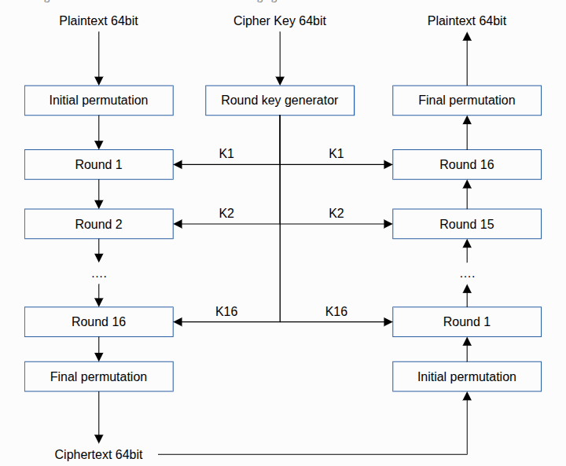
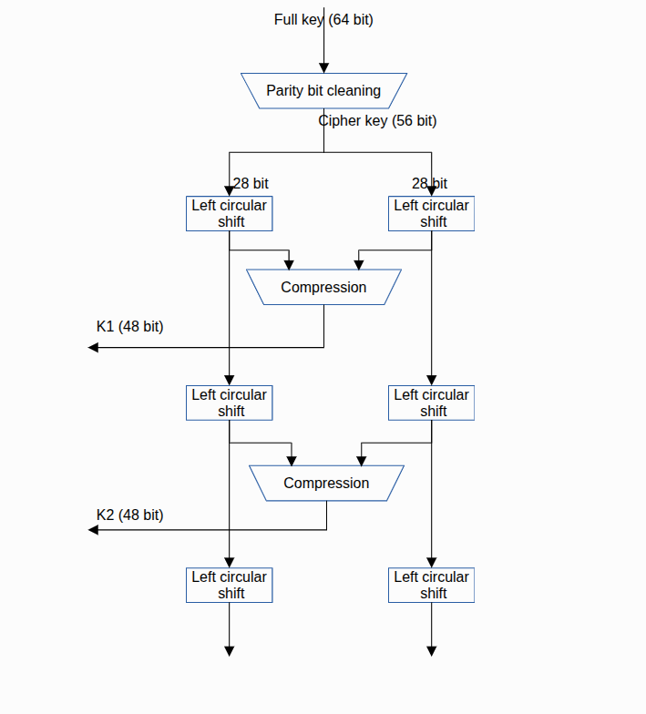
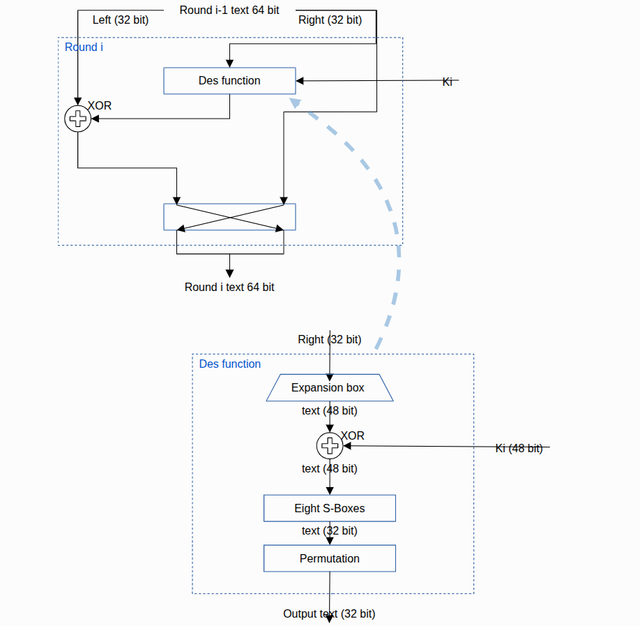

# DES Encrypted Chat Application

A peer-to-peer encrypted chat application implemented in Python. Messages are encrypted using the **DES (Data Encryption Standard)** block cipher operating in **CBC (Cipher Block Chaining)** mode with **PKCS5 padding**. The DES implementation is written from scratch in pure Python, referencing the open-source [pydes](https://github.com/RobinDavid/pydes) project by Robin David.

---

## Table of Contents

- [Overview](#overview)
- [How to Run](#how-to-run)
- [File Structure](#file-structure)
- [des.py — How DES Works (with Diagrams)](#despy--how-des-works-with-diagrams)
  - [Part 1: The Big Picture — Encryption & Decryption Flow](#part-1-the-big-picture--encryption--decryption-flow)
  - [Part 2: Key Schedule — How Subkeys Are Generated](#part-2-key-schedule--how-subkeys-are-generated)
  - [Part 3: Inside a Single Round — The Feistel Function](#part-3-inside-a-single-round--the-feistel-function)
  - [Part 4: Padding & CBC Mode — Handling Real Messages](#part-4-padding--cbc-mode--handling-real-messages)
  - [Part 5: Utility Functions](#part-5-utility-functions)
- [chat.py — The Encrypted Chat Application](#chatpy--the-encrypted-chat-application)
  - [How Messages Are Sent](#how-messages-are-sent)
  - [How Messages Are Received](#how-messages-are-received)
  - [Connection Setup](#connection-setup)
  - [Main Loop](#main-loop)
- [Security Notice](#security-notice)
- [References](#references)

---

## Overview

This project consists of two Python files:

| File | Purpose |
|------|---------|
| `des.py` | Pure-Python DES implementation (single-block + CBC mode) |
| `chat.py` | TCP peer-to-peer chat that uses `des.py` for encryption |

The chat works by having one party **listen** on a TCP port and the other **connect** to it. Every message typed by either party is encrypted with DES-CBC before being sent over the network, and decrypted upon receipt.

---

## How to Run

### Prerequisites

- Python 3.6 or higher (no external packages required)

### Start the listener (receiver)

```bash
python chat.py listen --port 5000 --key KUNCI123
```

### Connect from another machine (sender)

```bash
python chat.py connect --host <LISTENER_IP> --port 5000 --key KUNCI123
```

### Key format

- **8 ASCII characters**: e.g. `KUNCI123`, `secret_k`
- **16 hex digits** (representing 8 bytes): e.g. `4B554E434931323`

Both sides **must use the same key** or decryption will fail.

---

## File Structure

```
.
├── README.md           ← This file
├── des.py              ← DES cipher implementation (referenced from pydes)
├── chat.py             ← TCP encrypted chat application
└── images/
    ├── des_overview.png    ← Diagram: overall DES encrypt/decrypt flow
    ├── key_schedule.png    ← Diagram: how subkeys K1–K16 are generated
    └── feistel_round.png   ← Diagram: what happens inside each round
```

---

## des.py — How DES Works (with Diagrams)

---

### Part 1: The Big Picture — Encryption & Decryption Flow

<!-- INSERT IMAGE: images/des_overview.png -->



This diagram shows the **complete DES algorithm** from start to finish. Let's walk through it step by step, matching each box in the picture to the actual code.

---

#### Step 1: "Plaintext 64bit" → "Initial Permutation"

The 64-bit (8-byte) plaintext block enters the algorithm. The very first thing DES does is **rearrange (permute) the bits** using a fixed table called **PI** (Initial Permutation).

This doesn't add any security — it was designed for hardware efficiency in the 1970s — but it's part of the DES standard, so we must do it.

**The table in our code:**

```python
PI = [58, 50, 42, 34, 26, 18, 10, 2,
      60, 52, 44, 36, 28, 20, 12, 4,
      ...
      63, 55, 47, 39, 31, 23, 15, 7]
```

This means: "take bit 58 and put it in position 1, take bit 50 and put it in position 2, ..." and so on for all 64 bits.

**The code that does this** (inside `process_block()`):

```python
block = bytes_to_bit_array(block8)      # convert 8 bytes → list of 64 bits
block = self.permut(block, PI)           # rearrange bits using the PI table
```

The `permut()` method is very simple — it just picks bits according to the table:

```python
def permut(self, block, table):
    return [block[x - 1] for x in table]    # x-1 because table is 1-indexed
```

---

#### Step 2: Split into Left and Right halves

After the initial permutation, the 64-bit block is split into two 32-bit halves: **Left (L)** and **Right (R)**.

```python
g, d = nsplit(block, 32)    # g = Left half, d = Right half
```

In our code, `g` means "gauche" (French for left) and `d` means "droite" (French for right), following the naming from the pydes reference.

---

#### Step 3: "Round 1" through "Round 16" — The 16 Feistel Rounds

This is the **core of DES**. The same operation is repeated 16 times, each time using a different subkey (K1, K2, ..., K16).

As you can see in the diagram:
- **For encryption**: Round 1 uses K1, Round 2 uses K2, ..., Round 16 uses K16
- **For decryption**: Round 16 uses K1, Round 15 uses K2, ..., Round 1 uses K16 *(the keys are used in reverse order!)*

This is a beautiful property of the **Feistel structure** — you don't need a separate decryption algorithm. Just reverse the key order.

**The code** (inside `process_block()`):

```python
for i in range(16):                          # 16 rounds
    d_e = self.expand(d, E)                  # (explained in Part 3)
    if action == ENCRYPT:
        tmp = self.xor(self.keys[i], d_e)    # use K1, K2, ..., K16
    else:
        tmp = self.xor(self.keys[15 - i], d_e)  # use K16, K15, ..., K1
    tmp = self.substitute(tmp)               # (explained in Part 3)
    tmp = self.permut(tmp, P)                # (explained in Part 3)
    tmp = self.xor(g, tmp)
    g = d                                    # old Right becomes new Left
    d = tmp                                  # result becomes new Right
```

---

#### Step 4: "Final Permutation" → "Ciphertext 64bit"

After all 16 rounds, the Left and Right halves are **swapped** (R goes first, then L) and then the **Final Permutation (PI_1)** is applied. PI_1 is the exact inverse of PI — it undoes the initial permutation.

```python
final = self.permut(d + g, PI_1)    # note: d+g means R comes before L (the swap!)
return bit_array_to_bytes(final)    # convert 64 bits back to 8 bytes
```

**The PI_1 table:**

```python
PI_1 = [40, 8, 48, 16, 56, 24, 64, 32,
        39, 7, 47, 15, 55, 23, 63, 31,
        ...
        33, 1, 41, 9, 49, 17, 57, 25]
```

---

#### The Right Side of the Diagram: Decryption

Notice how the right side of the diagram is a **mirror image** of the left side. Decryption does the exact same steps, but:
- It starts with the **Final Permutation** (which undoes the initial permutation from encryption)
- The subkeys are used in **reverse order** (K16 first, K1 last)
- It ends with the **Initial Permutation** (which undoes the final permutation from encryption)

In our code, encryption and decryption use the **same method** (`process_block`), just with a different `action` flag that controls the key order.

---

### Part 2: Key Schedule — How Subkeys Are Generated

<!-- INSERT IMAGE: images/key_schedule.png -->



The center column of the first diagram showed a "Round key generator" — this second diagram zooms into that box and shows exactly how the 16 subkeys (K1 through K16) are created from your 8-byte key. This entire process happens in the `generatekeys()` method.

---

#### Step 1: "Full key (64 bit)" → "Parity bit cleaning" → "Cipher key (56 bit)"

Your key is 8 bytes = 64 bits, but DES only actually uses **56 of those bits**. Every 8th bit is a "parity bit" that gets thrown away. The **CP_1** table (Permuted Choice 1) does this — it selects 56 bits from the 64-bit key and rearranges them.

```python
key = bytes_to_bit_array(self.password)   # 64 bits
key = self.permut(key, CP_1)               # → 56 bits (parity bits dropped)
```

The **CP_1** table:

```python
CP_1 = [57, 49, 41, 33, 25, 17, 9,
        1, 58, 50, 42, 34, 26, 18,
        ...
        21, 13, 5, 28, 20, 12, 4]
```

Notice this table has **56 entries** (not 64) — that's how the 8 parity bits get dropped.

---

#### Step 2: Split into two 28-bit halves

The 56-bit key is split into a **left half (C)** and a **right half (D)**, each 28 bits.

```python
g, d = nsplit(key, 28)    # g = left 28 bits (C), d = right 28 bits (D)
```

---

#### Step 3: "Left circular shift" (repeated for each round)

As the diagram shows, for each round, **both halves are shifted left** by a certain number of positions. The bits that "fall off" the left end wrap around to the right end (that's what "circular" means).

The number of positions to shift depends on the round:

```python
SHIFT = [1, 1, 2, 2, 2, 2, 2, 2, 1, 2, 2, 2, 2, 2, 2, 1]
```

- Rounds 1, 2, 9, 16: shift by **1**
- All other rounds: shift by **2**
- Total shifts: 1+1+2+2+2+2+2+2+1+2+2+2+2+2+2+1 = **28** (so after all 16 rounds, the halves return to their original position)

**The code:**

```python
def shift(self, g, d, n):
    return g[n:] + g[:n], d[n:] + d[:n]
```

For example, if `g = [A,B,C,D,E]` and `n = 2`, then `g[2:] + g[:2]` = `[C,D,E,A,B]` — the first 2 elements moved to the end.

---

#### Step 4: "Compression" → Subkey Ki (48 bit)

After shifting, the two halves are merged back into 56 bits, and then **CP_2** (Permuted Choice 2) selects **48 bits** out of those 56 to form the round subkey.

Why 48 bits? Because in each Feistel round, the Right half is expanded from 32 to 48 bits (we'll see this in Part 3), and the subkey needs to be the same size for XOR.

```python
tmp = g + d                                  # merge back to 56 bits
self.keys.append(self.permut(tmp, CP_2))     # select 48 bits → subkey Ki
```

**The CP_2 table** (48 entries selecting from 56 bits):

```python
CP_2 = [14, 17, 11, 24, 1, 5, 3, 28,
        15, 6, 21, 10, 23, 19, 12, 4,
        ...
        34, 53, 46, 42, 50, 36, 29, 32]
```

---

#### The complete `generatekeys()` method:

```python
def generatekeys(self):
    self.keys = []
    key = bytes_to_bit_array(self.password)
    key = self.permut(key, CP_1)            # 64 → 56 bits (drop parity)
    g, d = nsplit(key, 28)                  # split into two 28-bit halves
    for i in range(16):                     # for each round:
        g, d = self.shift(g, d, SHIFT[i])   #   shift both halves
        tmp = g + d                         #   merge (56 bits)
        self.keys.append(self.permut(tmp, CP_2))  # compress → 48-bit subkey
```

After this runs, `self.keys` contains 16 subkeys: `[K1, K2, K3, ..., K16]`.

---

### Part 3: Inside a Single Round — The Feistel Function

<!-- INSERT IMAGE: images/feistel_round.png -->



This diagram shows two things:
1. **Top half**: What happens in one round (how Left and Right halves interact)
2. **Bottom half**: What's inside the "DES function" box (the F function)

---

#### Top Half: One Feistel Round

Looking at the top of the diagram:

1. The 64-bit input enters as **Left (32 bit)** and **Right (32 bit)**
2. The Right half goes into the **"DES function"** (F function) along with the round's subkey **Ki**
3. The output of the DES function is **XORed with the Left half**
4. Then the two halves **swap** (the X-shaped crossing in the diagram): old Right becomes new Left, and the XOR result becomes new Right

**The code for this** (inside `process_block()`):

```python
for i in range(16):
    # Right half 'd' goes into the F function (expanded, XORed with key, etc.)
    d_e = self.expand(d, E)              # part of the F function
    tmp = self.xor(self.keys[i], d_e)    # part of the F function
    tmp = self.substitute(tmp)           # part of the F function
    tmp = self.permut(tmp, P)            # part of the F function

    tmp = self.xor(g, tmp)              # XOR the F function output with Left half
    g = d                                # swap: old Right → new Left
    d = tmp                              # swap: XOR result → new Right
```

---

#### Bottom Half: Inside the DES Function (F Function)

The bottom of the diagram zooms into the "DES function" box. It has 4 steps:

---

##### Step A: "Expansion box" — Right (32 bit) → text (48 bit)

The 32-bit Right half needs to be XORed with the 48-bit subkey, so it must first be **expanded** from 32 to 48 bits. Some bits get duplicated.

```python
d_e = self.expand(d, E)    # 32 bits → 48 bits
```

The **E (Expansion)** table:

```python
E = [32, 1, 2, 3, 4, 5,
     4, 5, 6, 7, 8, 9,     # notice bit 4 and 5 appear twice
     8, 9, 10, 11, 12, 13,  # bit 8 and 9 appear twice
     ...
     28, 29, 30, 31, 32, 1]
```

The expansion takes each group of 4 adjacent bits and adds 1 bit from the neighboring group on each side, creating overlapping 6-bit groups.

---

##### Step B: "XOR" — text (48 bit) ⊕ Ki (48 bit) → text (48 bit)

The expanded 48-bit data is XORed with the 48-bit round subkey. This is where the **key actually mixes into the data**.

```python
tmp = self.xor(self.keys[i], d_e)    # 48 ⊕ 48 = 48 bits
```

---

##### Step C: "Eight S-Boxes" — text (48 bit) → text (32 bit)

This is the **most important step** in all of DES. The 48-bit result is split into **8 groups of 6 bits**, and each group is fed into a different **S-Box** (Substitution Box). Each S-Box takes 6 bits in and outputs 4 bits, so 8 × 4 = 32 bits total.

The S-Boxes are the **only non-linear part** of DES. Without them, DES would just be shuffling and XORing bits — which can be broken easily with math. The S-Boxes make the relationship between input and output complex and hard to reverse.

**How each S-Box lookup works:**

Each 6-bit group like `[b0, b1, b2, b3, b4, b5]`:
- **Row** = first bit + last bit combined → 2-bit number (0–3)
- **Column** = middle 4 bits combined → 4-bit number (0–15)
- Look up the value in `S_BOX[i][row][column]`

```python
def substitute(self, d_e):
    subblocks = nsplit(d_e, 6)           # split 48 bits into 8 groups of 6
    result = []
    for i in range(len(subblocks)):
        block = subblocks[i]
        row = (block[0] << 1) | block[5]                                    # first + last bit
        col = (block[1] << 3) | (block[2] << 2) | (block[3] << 1) | block[4]  # middle 4 bits
        val = S_BOX[i][row][col]          # lookup: 6 bits → 4-bit value
        result += [int(x) for x in binvalue(val, 4)]   # convert to 4 bits
    return result
```

**Example**: If a 6-bit group is `[1, 0, 1, 1, 0, 1]`:
- Row = first bit `1` and last bit `1` → binary `11` → row **3**
- Column = middle bits `0, 1, 1, 0` → binary `0110` → column **6**
- Look up `S_BOX[i][3][6]` → get a value like `13`
- Convert `13` to 4 bits: `1101`

---

##### Step D: "Permutation" — text (32 bit) → Output text (32 bit)

After the S-Box substitution, the 32-bit result is **rearranged** one more time using the **P** table. This ensures that in the next round, each S-Box's output bits are spread across multiple different S-Boxes, creating the "avalanche effect" (changing 1 input bit eventually changes ~half of all output bits).

```python
tmp = self.permut(tmp, P)
```

The **P** table:

```python
P = [16, 7, 20, 21, 29, 12, 28, 17,
     1, 15, 23, 26, 5, 18, 31, 10,
     2, 8, 24, 14, 32, 27, 3, 9,
     19, 13, 30, 6, 22, 11, 4, 25]
```

---

### Part 4: Padding & CBC Mode — Handling Real Messages

The three diagrams above explain how DES encrypts **a single 8-byte block**. But chat messages can be any length. We need two more things:

#### PKCS5 Padding — Making messages fit into 8-byte blocks

DES can only encrypt exactly 8 bytes at a time. If your message is `"hello"` (5 bytes), we need to add 3 extra bytes to make it 8. PKCS5 padding adds bytes whose **value equals the number of bytes added**:

| Message | Length | Padding needed | Padded result |
|---------|--------|----------------|---------------|
| `hello` | 5 | 3 bytes | `hello\x03\x03\x03` |
| `hi` | 2 | 6 bytes | `hi\x06\x06\x06\x06\x06\x06` |
| `12345678` | 8 | 8 bytes (full block!) | `12345678\x08\x08\x08\x08\x08\x08\x08\x08` |

The last case is important: even if the message is already 8 bytes, we **still add a full block of padding**. This way, when removing padding, we can always reliably know how many bytes to strip.

```python
def addPadding(data):
    pad_len = 8 - (len(data) % 8)
    return data + bytes([pad_len]) * pad_len

def removePadding(data):
    pad_len = data[-1]                # last byte tells us the padding length
    if pad_len < 1 or pad_len > 8 or data[-pad_len:] != bytes([pad_len]) * pad_len:
        raise ValueError("Padding tidak valid (key salah / data rusak)")
    return data[:-pad_len]            # strip the padding bytes
```

---

#### CBC Mode — Making identical messages look different

If we just encrypted each 8-byte block independently (called "ECB mode"), the same message with the same key would always produce the same ciphertext. An attacker could notice patterns.

**CBC (Cipher Block Chaining)** fixes this by **XORing each plaintext block with the previous ciphertext block** before encrypting. The first block is XORed with a random **IV (Initialization Vector)** that is generated fresh each time.

**Encryption:**
```
  IV (random) ──┐
                ▼
  Block 1  ──► XOR ──► DES Encrypt ──► Cipherblock 1 ──┐
                                                         │
               ┌─────────────────────────────────────────┘
               ▼
  Block 2  ──► XOR ──► DES Encrypt ──► Cipherblock 2 ──┐
                                                         │
               ┌─────────────────────────────────────────┘
               ▼
  Block 3  ──► XOR ──► DES Encrypt ──► Cipherblock 3

  Output sent over network: IV + Cipherblock1 + Cipherblock2 + Cipherblock3
```

**The code:**

```python
def encrypt(plaintext: bytes, key8: bytes) -> bytes:
    d = des()
    d.password = key8
    d.generatekeys()

    iv = os.urandom(8)                     # random 8-byte IV
    prev = iv
    out = b""
    data = addPadding(plaintext)           # pad to multiple of 8
    for i in range(0, len(data), 8):
        # XOR plaintext block with previous ciphertext (or IV for first block)
        blk = bytes(a ^ b for a, b in zip(data[i:i+8], prev))
        prev = d.process_block(blk, ENCRYPT)   # encrypt the XORed block
        out += prev
    return iv + out                        # prepend IV so receiver can decrypt
```

**Decryption** (reverse process):

```python
def decrypt(blob: bytes, key8: bytes) -> bytes:
    d = des()
    d.password = key8
    d.generatekeys()

    iv, ct = blob[:8], blob[8:]            # extract IV and ciphertext
    if len(ct) == 0 or len(ct) % 8:
        raise ValueError("Panjang ciphertext tidak valid")
    prev = iv
    out = b""
    for i in range(0, len(ct), 8):
        blk = ct[i:i+8]
        decrypted = d.process_block(blk, DECRYPT)  # decrypt the block
        out += bytes(a ^ b for a, b in zip(decrypted, prev))  # XOR with prev
        prev = blk
    return removePadding(out)              # strip padding
```

---

### Part 5: Utility Functions

These are helper functions that convert between different data formats.

#### `bytes_to_bit_array(data)` — Bytes → Bits

Converts a `bytes` object into a list of 0s and 1s. DES works on individual bits, but Python naturally works with bytes, so we need this conversion.

```python
def bytes_to_bit_array(data):
    array = []
    for byte in data:
        for i in range(7, -1, -1):          # from most significant to least significant
            array.append((byte >> i) & 1)    # extract each bit
    return array
```

**Example:** `b"\xCA"` (hex CA = binary 11001010) → `[1, 1, 0, 0, 1, 0, 1, 0]`

#### `bit_array_to_bytes(bits)` — Bits → Bytes

The reverse: takes a list of 0s and 1s and packs them back into bytes.

```python
def bit_array_to_bytes(bits):
    result = bytearray()
    for i in range(0, len(bits), 8):        # process 8 bits at a time
        val = 0
        for bit in bits[i:i+8]:
            val = (val << 1) | bit           # shift left and add next bit
        result.append(val)
    return bytes(result)
```

#### `nsplit(data, n)` — Split a list into chunks

```python
def nsplit(data, n):
    return [data[k:k+n] for k in range(0, len(data), n)]
```

Used to split 64-bit blocks into two 32-bit halves, 56-bit keys into two 28-bit halves, 48-bit data into eight 6-bit groups for S-Boxes, etc.

#### `binvalue(val, bitsize)` — Integer → binary string

```python
def binvalue(val, bitsize):
    binval = bin(val)[2:]
    return binval.zfill(bitsize)    # pad with leading zeros
```

Converts a number to its binary string representation with a fixed width. Used to convert S-Box output values (0–15) into 4-bit strings.

---

## chat.py — The Encrypted Chat Application

`chat.py` is the networking layer that uses `des.py` to send and receive encrypted messages over TCP between two different devices.

### How Messages Are Sent

```python
def send_msg(sock, text, key):
    blob = des.encrypt(text.encode("utf-8"), key)
    print(f"   [SEND] plaintext : {text}")
    print(f"   [SEND] ciphertext: {blob[8:].hex().upper()} (IV={blob[:8].hex().upper()})")
    sock.sendall(struct.pack(">I", len(blob)) + blob)
```

When you type a message and press Enter:

1. The text string is encoded to UTF-8 bytes
2. `des.encrypt()` encrypts it using DES-CBC → produces `IV + ciphertext`
3. The plaintext and ciphertext (in hex) are printed so you can see both
4. The message is sent over TCP with a **4-byte length header** followed by the encrypted blob

**Wire format:**

```
[4 bytes: length of blob] [8 bytes: IV] [N bytes: ciphertext]
```

The length header tells the receiver exactly how many bytes to read.

---

### How Messages Are Received

```python
def receiver_loop(sock, key, peer):
    try:
        while True:
            (n,) = struct.unpack(">I", recv_exact(sock, 4))   # read length
            blob = recv_exact(sock, n)                         # read encrypted data
            print(f"\n   [RECV] ciphertext: {blob[8:].hex().upper()} (IV={blob[:8].hex().upper()})")
            try:
                print(f"   [RECV] plaintext : {des.decrypt(blob, key).decode('utf-8')}   (dari {peer})")
            except Exception as e:
                print(f"   [RECV] gagal dekripsi: {e}")
            print("> ", end="", flush=True)
    except (ConnectionError, OSError):
        print("\n[!] Lawan bicara terputus.")
```

This runs in a **background thread** so it can receive messages while you're typing. For each incoming message:

1. Read the 4-byte length header → know how many bytes to expect
2. Read exactly that many bytes (the encrypted blob)
3. Display the ciphertext in hex
4. Decrypt with `des.decrypt()` and display the plaintext
5. If decryption fails (wrong key), print "gagal dekripsi" (decryption failed)

The `recv_exact()` helper ensures we read exactly `n` bytes, since TCP may deliver data in chunks:

```python
def recv_exact(sock, n):
    buf = b""
    while len(buf) < n:
        chunk = sock.recv(n - len(buf))
        if not chunk:
            raise ConnectionError("Koneksi ditutup")
        buf += chunk
    return buf
```

---

### Connection Setup

```python
def main():
    ap = argparse.ArgumentParser()
    ap.add_argument("mode", choices=["listen", "connect"])
    ap.add_argument("--host", default="0.0.0.0")
    ap.add_argument("--port", type=int, default=5000)
    ap.add_argument("--key", required=True)
    a = ap.parse_args()
```

The program accepts command-line arguments:

| Argument | Required | Description |
|----------|----------|-------------|
| `mode` | Yes | `listen` (act as server) or `connect` (act as client) |
| `--host` | No | IP to bind to (listen) or connect to (connect). Default: `0.0.0.0` |
| `--port` | No | TCP port. Default: `5000` |
| `--key` | Yes | DES key — 8 ASCII chars or 16 hex digits |

**Key parsing:** If the key is 16 hex characters, it's treated as hex-encoded bytes. Otherwise, it's treated as ASCII.

```python
key = bytes.fromhex(a.key) if len(a.key) == 16 and all(c in "0123456789abcdefABCDEF" for c in a.key) else a.key.encode()
if len(key) != 8:
    sys.exit("Key harus 8 byte (8 karakter ASCII atau 16 hex).")
```

**Listen mode** (server):

```python
srv = socket.socket()
srv.setsockopt(socket.SOL_SOCKET, socket.SO_REUSEADDR, 1)  # allow quick restart
srv.bind((a.host, a.port))
srv.listen(1)
print(f"[*] Menunggu koneksi di {a.host}:{a.port} ...")
sock, addr = srv.accept()    # blocks until someone connects
```

**Connect mode** (client):

```python
sock = socket.create_connection((a.host, a.port))
```

---

### Main Loop

```python
threading.Thread(target=receiver_loop, args=(sock, key, peer), daemon=True).start()
try:
    while True:
        line = input("> ")
        if line.strip().lower() == "exit": break
        if line: send_msg(sock, line, key)
except (EOFError, KeyboardInterrupt):
    pass
sock.close()
```

- The receiver runs in a **daemon thread** (automatically killed when the main thread exits)
- The main thread waits for user input in a loop
- Typing `exit`, pressing `Ctrl+C`, or `Ctrl+D` cleanly disconnects
- Non-empty lines are encrypted and sent

---

## Security Notice

> ⚠️ **DES is NOT secure for production use.** DES has a 56-bit key, which is vulnerable to brute-force attacks. It was officially retired by NIST in 2005. This implementation is for **educational purposes only** — to understand symmetric-key cryptography, Feistel networks, and block cipher modes of operation.
>
> For real-world applications, use **AES-256** (via Python's `cryptography` library or similar).

---

## References

- [FIPS 46-3: Data Encryption Standard (DES)](https://csrc.nist.gov/publications/detail/fips/46/3/archive/1999-10-25) — The official DES specification
- [pydes by Robin David](https://github.com/RobinDavid/pydes) — Pure-Python DES reference implementation used as the basis for this code
- [Wikipedia: DES](https://en.wikipedia.org/wiki/Data_Encryption_Standard) — General overview of the algorithm
- [Wikipedia: Feistel cipher](https://en.wikipedia.org/wiki/Feistel_cipher) — The structure underlying DES
- [Wikipedia: Block cipher mode of operation (CBC)](https://en.wikipedia.org/wiki/Block_cipher_mode_of_operation#CBC) — How CBC mode works
